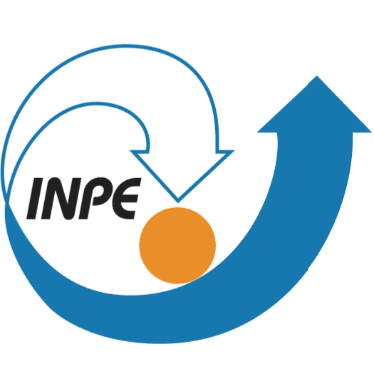

# 🛰️ CCS-INPE

[🇧🇷 Português](./README.pt-br.md) • [🇺🇸 English](./README.md)

  

  Satellite operations and mission control at INPE.

---

## 🚀 About CCS

The **Centro de Controle de Satélites (CCS)** is responsible for the operation and control of the satellites managed by **INPE**.

CCS acts as the operational core of the satellite control system, coordinating mission monitoring, orbital dynamics, communication with Ground Stations, and operational planning.

Its infrastructure is mainly based on two major software systems:

* **Real-Time System**
* **Orbital Dynamics System**

---

## 🛰️ Real-Time Operations

The Real-Time System receives telemetry data transmitted by satellites through Ground Stations during orbital passes.

Its responsibilities include:

* Receiving and processing telemetry data
* Converting raw data into physical measurements
* Monitoring onboard subsystems
* Operational visualization for controllers
* Mission data storage and archival
* Telecommand generation and transmission
* Coordination of ranging and velocity measurement sessions

These operations allow continuous monitoring of satellite health and operational status.

---

## 🌍 Orbital Dynamics

The Orbital Dynamics System processes tracking data received from Ground Stations to determine and predict satellite orbits.

Its activities include:

* Orbit determination and propagation
* Prediction of future satellite passes
* Visibility calculations for Ground Stations
* Orbital correction planning
* Attitude maneuver scheduling

This system is essential for mission planning and maintaining proper satellite positioning.

---

## 📡 Ground Station Coordination

CCS is also responsible for Ground Station operational management.

This includes:

* Optimization of multi-satellite tracking
* Resolution of simultaneous pass conflicts
* Communication window coordination
* Operational scheduling of Ground Stations

---

## ⚙️ Mission Monitoring

Among other activities, CCS is also responsible for monitoring:

* Propellant consumption
* Onboard clock synchronization
* Battery voltage evolution
* Electrical bus current
* Satellite subsystem performance

These activities are essential to ensure mission reliability and extend satellite operational lifetime.

---

## 🔗 Links

* CCS-INPE
  https://www.inpe.br/crc/ccs.php

* INPE
  https://www.gov.br/inpe/pt-br

---

  <b>Space Operations • Mission Control</b>

